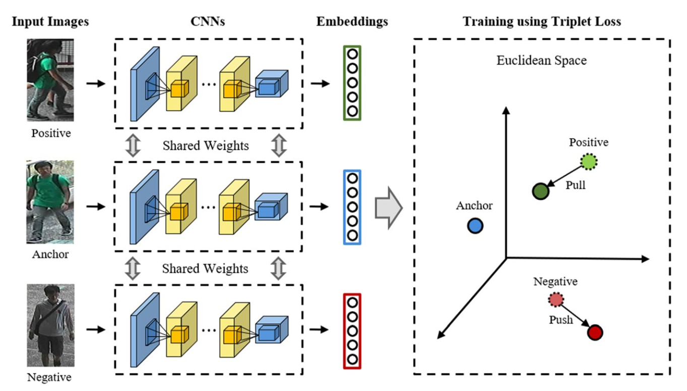
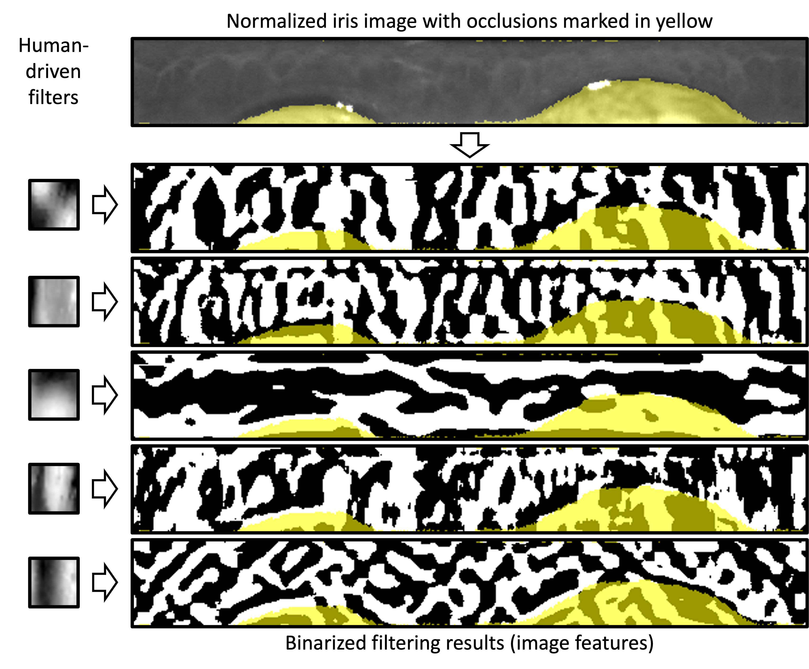
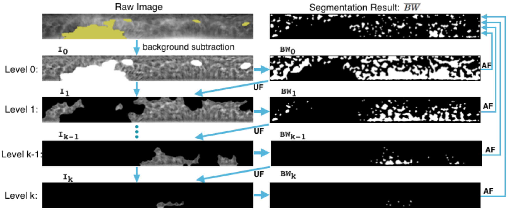
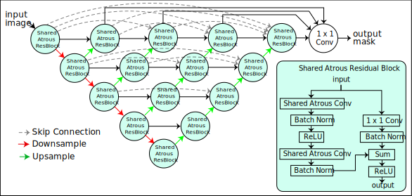
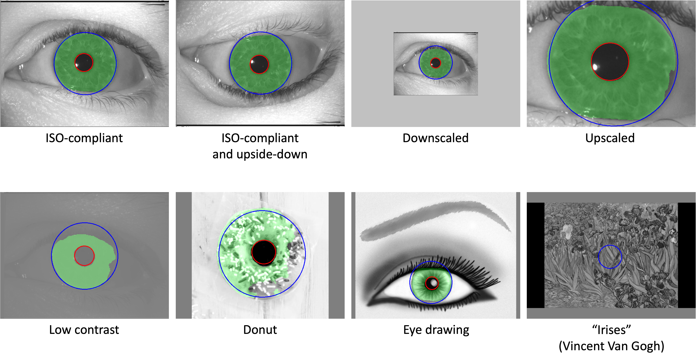
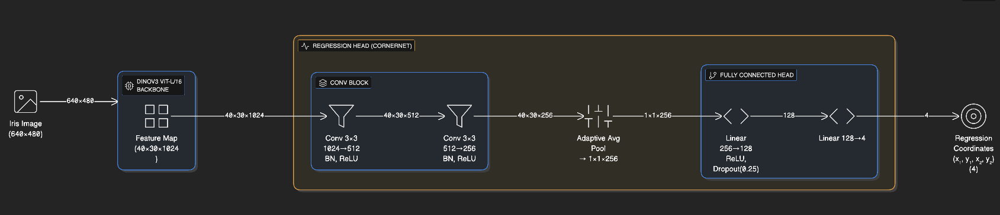
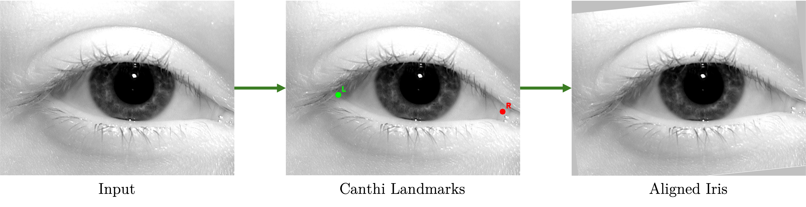

# Open-source iris recognition 

## Table of contents
* [Summary](#summary)
	* [Purpose of this repository](#summary-purpose)
	* [Motivation for IREX-vetted open source iris recognition solutions](#summary-motivation)
	* [Equivalence of C++ / Python / Matlab implementations](#summary-equivalence)
* [Iris encoding methods](#methods)
	* [ArcIris: ResNet trained with ArcFace loss](#methods-ArcIris)
	* [TripletNN: ConvNeXt-tiny trained with batch-hard triplet mining loss](#methods-TripletNN)
	* [HDBIF: Human-Driven Binary Image Features](#methods-HDBIF)
	* [CRYPTS: Human-Interpretable Features](#methods-CRYPTS)
* [Auxliary tools](#auxliary)
	* [Iris image segmentation](#auxliary-SEGM)
	* [Eye canthi detector](#auxliary-CANTHI)
* [Citations](#citations)
* [Acknowledgments](#acknowledgments)
* [License](#license)
* [Other open-source iris recognition-related repositories](#other)
* [Contact](#contact)

<a name="summary"/></a>
## Summary

<a name="summary-purpose"/></a>
### Purpose of this repository

The primary goal of this repository is to offer open-source academic iris recognition methods developed in the [Computer Vision Research Laboratory](https://cvrl.nd.edu) at the [Univesity of Notre Dame, IN, USA](https://nd.edu). 

In addition to Python and/or Matlab codes of the offered methods, the repository also includes the C++ versions submitted to the [Iris Exchange (IREX) 10 Identification Track](https://pages.nist.gov/IREX10/) administered by NIST’s Biometrics Research Laboratory. The C++ versions may serve as a model, from both organizational and software engineering points of view, that helps to bring more academic groups and their contributions to the IREX table.

<a name="summary-motivation"/></a>
### Motivation for IREX-vetted open-source iris recognition solutions

There are a plethora of commercial and academic implementations of automated algorithms for iris identification, which differ in accuracy, time of execution, and generalization capabilities (to new sensors, subjects, ethnic groups, time between enrollment and verification, etc.). However, the many IREX evaluations have been populated largely by commercial (closed-source) algorithm submissions. It is desirable to use the capabilities of the IREX program to also incorporate open-source solutions, including those from academic institutions. There are at least three good reasons for this: 

- reproducible, trustworthy, and professionally-tested algorithms would serve as an important baseline and benchmark for academic efforts to design new iris recognition methods,

- having an algorithm from an academic unit submitted to and vetted by IREX X may decrease the reluctance of the academic community to have their methods evaluated in the IREX program,

- freely accessible, well-documented, and IREX-tested software packages may facilitate fast deployments of iris recognition in smaller-scale or pilot implementations before the adoption of professional solutions.

<a name="summary-equivalence"/></a>
### Equivalence of C++ / Python / Matlab implementations

The authors made a significant effort to keep implementations of the same method methodologically equivalent. However, there may be slight differences in the performance among the C++/Python/Matlab implementations observed for the same method and the same data. This is related to differences in implementations of various computer vision and machine learning routines available in C++/Python/Matlab packages.


<a name="methods"/></a>
## Brief description of the methods offered

<a name="methods-ArcIris"/></a>
### ResNet neural network trained with ArcFace loss (ArcIris)

- [x] [Python codes](methods/ArcIris/Python)
- [x] [C++ (IREX X) codes](methods/ArcIris/C++-IREX-X-submission)
- [x] ND [IREX X](https://pages.nist.gov/IREX10/) submission: `ndcvrl_002` (2025-05-12)

The encoding model used here is a 100-layer ResNet model (ResNet100) adopted from the [official ArcFace PyTorch implementation](https://github.com/deepinsight/insightface/tree/master/recognition/arcface_torch). The model operates on polar-normalized iris images (512x64 px), derived from 640x480 originals via [Daugman's rubber sheet model](https://www.robots.ox.ac.uk/~az/lectures/est/iris.pdf), which unwraps the circular iris region into a rectangular format. The model was modified to work with input images in this format rather than the typical 112x112 px images, hence the name ArcIris. The ResNet100 backbone was chosen for its strong tradeoff in computational efficiency and accuracy when compared with its ResNet50 and ResNet200 counterparts, which is relevant for meeting timing constraints imposed by NIST IREX X evaluations.

ArcIris was trained using ArcFace loss, which optimizes feature embeddings on a hypersphere using an additive angular margin. Unlike traditional Euclidean-based losses, ArcFace uses cosine similarity and directly enforces angular separation between classes. This design intuitively enhances intra-class compactness and inter-class discrepancy. Model variants are evaluated by calculating the $d'$ (sensitivity or decidability) index for genuine and impostor score distributions: a larger $d'$ indicates that the genuine and impostor means are farther apart (greater inter-class separability) and/or their variances are smaller (greater intra-class compactness). The final ArcIris solution is based on the training checkpoint for which $d'$ was maximum during validation.

**Related papers:** 
- John Daugman, "How iris recognition works," IEEE Transactions on Circuits and Systems for Video Technology, vol. 14, no. 1, pp. 21-30, Jan. 2004 [[PDF]](https://www.robots.ox.ac.uk/~az/lectures/est/iris.pdf)
- Jiankang Deng, Jia Guo, Niannan Xue, and Stefanos Zafeiriou, “ArcFace: Additive Angular Margin Loss for Deep Face Recognition,” IEEE/CVF Conference on Computer Vision and Pattern Recognition, pp. 4690–4699, 2019 [[PDF]](https://openaccess.thecvf.com/content_CVPR_2019/papers/Deng_ArcFace_Additive_Angular_Margin_Loss_for_Deep_Face_Recognition_CVPR_2019_paper.pdf)


<a name="methods-TripletNN"/></a>
### ConvNeXt-tiny neural network trained with batch-hard triplet mining (TripletNN)

- [x] [Python codes](methods/TripletNN/Python)
- [x] [C++ (IREX X) codes](methods/TripletNN/C++-IREX-X-submission)
- [x] ND [IREX X](https://pages.nist.gov/IREX10/) submission: `ndcvrl_001` (2024-11-19)

The encoding model used here is the smallest version of ConvNeXt (dubbed ConvNeXt-tiny) trained with batch-hard triplet mining loss on polar-normalized iris images. We use ConvNeXt-tiny due to timing constraints enforced by NIST.

ConvNeXt models are a family of pure convolutional neural networks (ConvNets) that have been designed to be accurate, efficient, and scalable. They are inspired by the design of Vision Transformers (ViTs), which have recently become the state-of-the-art for image classification tasks. However, ConvNeXts are built entirely from standard ConvNet modules, making them simpler and more efficient to train and deploy. 

The paper's authors start from a basic ResNet architecture and optimize different aspects of the network by: i) using grouped convolutions like ResNeXt to increase model capacity and efficiency, ii) adapting the inverted bottleneck design pattern, commonly used in mobile architectures, to improve the efficiency of the network, iii) using larger kernels (e.g., 7x7) to help capture long-range dependencies more effectively, iv) Replacing Batch Normalization with Layer Normalization, as commonly used in Transformers, to improve training stability and performance, v) dividing the model into stages with increasing feature maps and decreasing spatial resolution inspired by the hierarchical structure of Vision Transformers, vi) using modern training techniques like Mixup and CutMix, which improve generalization and robustness and vii) using techniques like Stochastic Depth and Label Smoothing to prevent overfitting. By combining these architectural and training improvements, ConvNeXt models achieve superior performance compared to traditional ConvNets, closing the gap with Vision Transformers while maintaining the efficiency and simplicity of convolutional architectures. 

Triplet mining loss is a technique used to learn embeddings by increasing the distance between unrelated data points (negative pairs) while simultaneously reducing the distance between related data points (positive pairs). This is achieved by enforcing a specific margin, a minimum distance that must exist between negative pairs. As illustrated below, a negative sample is an image belonging to a different class than the anchor image. The model aims to position these negative samples further away from the anchor in the embedding space. Conversely, a positive sample is an image from the same class as the anchor. The model seeks to place these positive samples closer to the anchor, effectively clustering similar data points together.

<div style="text-align: center;">

</div>

[Figure source](https://link.springer.com/article/10.1007/s11227-021-03994-z)

Batch-hard triplet mining is a strategy that focuses on the most challenging negative samples for each anchor-positive pair within a batch. By concentrating on these hardest negatives, the model can learn more discriminative representations and improve its overall performance.

**Related papers:**
- Zhuang Liu, Hanzi Mao, Chao-Yuan Wu, Christoph Feichtenhofer, Trevor Darrell, and Saining Xie. "A ConvNet for the 2020s," In Proceedings of the IEEE/CVF Conference on Computer Vision and Pattern Recognition, pp. 11976-11986, 2022 [[PDF]](https://openaccess.thecvf.com/content/CVPR2022/papers/Liu_A_ConvNet_for_the_2020s_CVPR_2022_paper.pdf)
- Florian Schroff, Dmitry Kalenichenko, and James Philbin. "FaceNet: A Unified Embedding for Face Recognition and Clustering," In Proceedings of the IEEE/CVF Conference on Computer Vision and Pattern Recognition, pp. 815-823, 2015 [[PDF]](https://www.cv-foundation.org/openaccess/content_cvpr_2015/app/1A_089.pdf)


<a name="methods-HDBIF"/></a>
### Human-Driven Binary Image Features (HDBIF)

- [x] [Python codes](methods/HDBIF/Python)
- [x] [Matlab codes](methods/HDBIF/Matlab)
- [x] [C++ (IREX X) codes](methods/HDBIF/C++-IREX-X-submission)
- [ ] Submitted to [IREX X](https://pages.nist.gov/IREX10/), not in the leaderboard yet

The HDBIF method leverages human perception capabilities in iris recognition. It utilizes N filtering kernels learned via Independent Component Analysis in a way to maximize the statistical independence of the filtered iris image patches identified, via eye tracking, as salient for humans:

<div style="text-align: center;">

</div>

The normalized iris image is then convolved with the human-driven filters and the results are binarized to calculate the iris template: 

<div style="text-align: center;">

</div>

During matching, by utilizing the segmentation masks, the HDBIF method only considers overlapping iris regions between two iris templates and calculates the comparison score using fractional Hamming distance. The method utilizes score normalization proposed by Daugman:

$$HD_{norm} = 0.5 - (0.5 * HD_{raw}) * \sqrt{\frac{n_{bits}}{n_{typical}}}$$

where $HD_{norm}$ is the normalized score, $HD_{raw}$ is the raw score, $n_{bits}$ is the number of bits compared, and $n_{typical}$ is the usual number of bits compared when comparing two iris images. To find $n_{typical}$, we combine the public datasets available from Notre Dame and calculate the average number of bits overlapping between polar-normalized masks.

**Related papers:** 
- A. Czajka, D. Moreira, K. Bowyer and P. Flynn, "Domain-Specific Human-Inspired Binarized Statistical Image Features for Iris Recognition," IEEE Winter Conference on Applications of Computer Vision (WACV), Waikoloa, HI, USA, pp. 959-967, 2019 [[IEEEXplore]](https://ieeexplore.ieee.org/document/8658238)
- D. Moreira, M. Trokielewicz, A. Czajka, K. Bowyer and P. Flynn, "Performance of Humans in Iris Recognition: The Impact of Iris Condition and Annotation-Driven Verification," IEEE Winter Conference on Applications of Computer Vision (WACV), Waikoloa, HI, USA, pp. 941-949, 2019 [[IEEEXplore]](https://ieeexplore.ieee.org/document/8658624)

<a name="methods-CRYPTS"/></a>
### Human-Interpretable Features (CRYPTS)

- [x] [C++ (IREX X) codes](methods/CRYPTS/C++-IREX-X-submission)
- [ ] Submitted to [IREX X](https://pages.nist.gov/IREX10/), not in the leaderboard yet

This method considers Fuch's crypts as salient, localized, human-detectable features for iris matching. Crypts are extracted from images utilizing a strategy based on a sequence of morphological operations and connected component extractions as illustrated in the figure below:

<div style="text-align: center;">

</div>

The crypt masks found serve as the iris template in this method. The crypt masks are then matched using the Earth Mover's Distance.

**Related paper:** J. Chen, F. Shen, D. Z. Chen and P. J. Flynn, "Iris Recognition Based on Human-Interpretable Features," in IEEE Transactions on Information Forensics and Security, vol. 11, no. 7, pp. 1476-1485, 2016 [[IEEEXplore]](https://ieeexplore.ieee.org/document/7422104)


<a name="auxiliary"/></a>
## Auxliary tools

<a name="auxiliary-SEGM"/></a>
### Iris image segmentation

- [x] [Python and C++ (IREX X) codes](methods/) are already included into iris encoding codes
- [ ] Used in ND [IREX X](https://pages.nist.gov/IREX10/) submissions: `ndcvrl_002` (2025-05-12), `ndcvrl_001` (2024-11-19)

The iris segmentation compises two models. The first model does a classical pixel-wise estimation of the iris mask marking those pixels, which correspond to the iris texture (that is, are not occluded by eyelids, eyelashes or various deformations such as deformed/dried cornea in case of post-mortem samples). The segmentation model architecture is based on Unet++ with shared atrous residual blocks, and is illustrated below. The second model is a simple regressor estimating the circular approximations of the iris inner and outer iris boundaries.

<div style="text-align: center;">

</div>

To train the pixel-wise  segmentation model, we utilized a set of iris images with their corresponding ground truth masks, sampled from a large corpus of publicly-available datasets: i) BioSec, ii) BATH, iii) ND-Iris-0405, iv) CASIA-V4-Iris-Interval, v) UBIRIS v2, vi) Warsaw-BioBase-Disease-Iris v2.1, and vii) Warsaw-BioBase-Post-Mortem-Iris v2.0. 

To train the model estimating the circular approximations of the iris boundaries, we utilize the Open Eye Dataset (OpenEDS). We excluded images where the iris was significantly off-center, carried out Hough transform to get the ground truth pupil and iris circle parameters, and utilized these samples to train our circle parameter estimation model.

Here's an illustration of segmentations found by the models on a few images from the public IREX X validation set:

<div style="text-align: center;">

</div>

**Matlab version**

The Matlab version of the segmenter uses the [SegNet](https://ieeexplore.ieee.org/document/7803544) architecture. It was trained on the same set of iris images with their corresponding binary masks as the Python and C++ versions. Circular approximations are estimated by a Hough Transform applied to binary masks.

**Related paper:** M. Trokielewicz, A. Czajka, P. Maciejewicz, “Post-mortem iris recognition with deep learning-based image segmentation,” Image and Vision Computing, Vol. 94 (103866), Feb. 2020 [[Elsevier]](https://www.sciencedirect.com/science/article/pii/S0262885619304597) [[ArXiv]](https://arxiv.org/abs/1901.01708)


<a name="auxiliary-CANTHI"/></a>
### Eye canthi detector

- [x] [Python codes](methods/CanthiDetector/Python)

The `CornerNet` model detects left and right iris canthi using **DINOv3 features** and a lightweight regression head put on top on DINO-sourced embeddings. The figure below illustrates the architecture of the solution. It was trained on approx. 900 iris images sourced from Notre Dame datasets, with eye canthi manually annotated by Notre Dame faculty members and students.



The model returns positions of the left and right (whichever exists) canthi. As illustrated below, those canthi can be used to align an iris image so that both corners are placed horizontally.




<a name="citations"/></a>
## Citations

This GitHub repository:

```
@Misc{ND_OpenSourceIrisRecognition_GitHub,
  howpublished = {\url{https://github.com/CVRL/OpenSourceIrisRecognition/}},
  note         = {Accessed: ...},
  title        = {{University of Notre Dame Open Source Iris Recognition Repository}},
  authors      = {Adam Czajka and Siamul Karim Khan and Mateusz Trokielewicz and Patrick J. Flynn},
}
```

A research paper summarizing the IREX-X submissions of the HDBIF, CRYPTS and TripletNN is planned to be submitted for review and to ArXiv soon.


<a name="acknowledgments"/></a>
## Acknowledgments

1. The development of the C++ (IREX X-compliant) versions of the HDBIF and CRYPTS methods was supported by the U.S. Department of Commerce (grant No. 60NANB22D153). The views and conclusions contained in this document are those of the authors and should not be interpreted as representing the official policies, either expressed or implied, of the U.S. Department of Commerce or the U.S. Government. Lead PI: [Adam Czajka](https://engineering.nd.edu/faculty/adam-czajka), Co-PI: [Patrick Flynn](https://sites.nd.edu/patrick-flynn/), graduate research assistant: [Siamul Karim Khan](https://www.siamul.info).

2. The segmentation model used in the Matlab version of the HDBIF method was developed by [Mateusz Trokielewicz](https://scholar.google.pl/citations?user=ojQN288AAAAJ&hl=en) at Warsaw University of Technology, Poland, and was part of his PhD dissertation advised by [Adam Czajka](https://engineering.nd.edu/faculty/adam-czajka).


<a name="license"/></a>
## License
This is a research open-source software. You are free to use it in your research projects upon citing the sources as indicated in the [Citations](#citations) section. Please discuss individual licensing options if you want to use this software for commercial purposes, or to create and distribute closed source versions.


<a name="other"/></a>
## Other open-source iris recognition-related repositories

This repository makes an attempt to list all available open source iris recognition algorithms offered by other teams. If you know a repository that should be included, but is not listed here, please open a pull request.

### OpenAI / WorldCoin IRIS: Iris Recognition Inference System ###

**Source Codes:** [[official GitHub]](https://github.com/worldcoin/open-iris)

**Blog post:** [Iris recognition inference system](https://world.org/blog/engineering/iris-recognition-inference-system)

### OSIRIS (Open Source IRIS) ###

**Source Codes:** [[official]](http://svnext.it-sudparis.eu/svnview2-eph/ref_syst/Iris_Osiris_v4.1) [[dockerized]](https://github.com/tohki/iris-osiris) [[VMBOX: CiTER implementation]](https://github.com/ClarksonCITeR/osiris_vmbox)

**Paper:**  N. Othman, B. Dorizzi, S. Garcia-Salicetti, „OSIRIS: An open source iris recognition software,” Pattern Recognition Letters, Volume 82, Part 2, pp. 124-131, 2016 [[Elsevier]](https://www.sciencedirect.com/science/article/abs/pii/S0167865515002986)

### USIT v3.0.0 ###

**Source Codes:** [[official]](https://www.wavelab.at/sources/Rathgeb16a/)

**Paper:** C. Rathgeb, A. Uhl, P. Wild, and H. Hofbauer. “Design Decisions for an Iris Recognition SDK,” in K. Bowyer and M. J. Burge, editors, Handbook of iris recognition, Second edition, Advances in Computer Vision and Pattern Recognition, Springer, 2016 [[Springer]](https://link.springer.com/chapter/10.1007/978-1-4471-6784-6_16)

### ThirdEye ###

**Source Codes:** [[official]](https://github.com/sohaib50k/ThirdEye---Iris-recognition-using-triplets) (note: the weights were obtained directly from authors after requesting them)

**Paper:** S. Ahmad and B. Fuller, "ThirdEye: Triplet Based Iris Recognition without Normalization,"  IEEE International Conference on Biometrics Theory, Applications and Systems (BTAS), pp. 1-9, 2019 [[IEEEXplore]](https://ieeexplore.ieee.org/document/9185998) [[ArXiv]](https://arxiv.org/abs/1907.06147)

### Dynamic Graph Representation (DGR) ###

**Source Codes:** [[official]](https://github.com/RenMin1991/Dyamic_Graph_Representation)

**Papers:** 
- Ren, M., Wang, Y., Sun, Z., & Tan, T. “Dynamic Graph Representation for Occlusion Handling in Biometrics,” Proceedings of the AAAI Conference on Artificial Intelligence, 34(07), pp. 11940-11947, 2020 [[AAAI]](https://ojs.aaai.org/index.php/AAAI/article/view/6869) [[ArXiv]](https://arxiv.org/pdf/1912.00377v2.pdf)
- Ren, M., Wang, Y., Zhu, Y., Zhang, K., & Sun, Z. “Multiscale Dynamic Graph Representation for Biometric Recognition with Occlusions,” IEEE Transactions on Pattern Analysis and Machine Intelligence, 2023 [[IEEEXplore]](https://ieeexplore.ieee.org/document/10193782) [[ArXiv]](https://arxiv.org/pdf/2307.14617.pdf)

### Human-Interpretable Patch-Based Iris Matching (PBM) ###

**Source codes:** [[official]](https://github.com/CVRL/PBM)

**Paper:** A. Boyd, D. Moreira, A. Kuehlkamp, K. Bowyer, A. Czajka, „Human Saliency-Driven Patch-based Matching for Interpretable Post-mortem Iris Recognition,” IEEE Winter Conference on Applications of Computer Vision Workshops (WACVW), 2023 [[IEEE/CVF]](https://openaccess.thecvf.com/content/WACV2023W/XAI4B/papers/Boyd_Human_Saliency-Driven_Patch-Based_Matching_for_Interpretable_Post-Mortem_Iris_Recognition_WACVW_2023_paper.pdf)


### Iris Analysis Toolkit (MITRE) ###

**Source codes:** [[official]](https://github.com/mitre/iat)

<a name="contact"/></a>
## Contact

In case of questions related to this project and repository, contact [Adam Czajka](https://engineering.nd.edu/faculty/adam-czajka/) (aczajka@nd.edu). 

