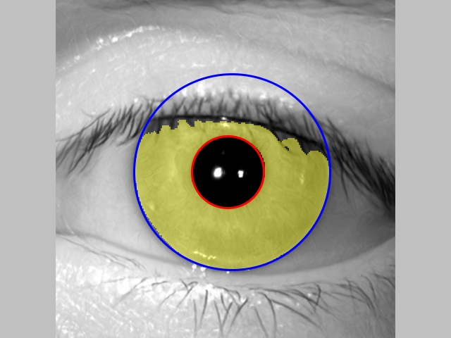

## Installation 

1. Clone the repository.
2. Download the segmentation models and the filtering kernels from:
   
   `https://notredame.box.com/s/826rw173vk853ddh2g19wxbitsxc3oaj`

   and copy them to the `models` and `filters_txt` folders, respectively.

3. Upload your iris image samples to the `data` folder, and define your matching pairs in the `imageList.txt` file. This repository includes samples that were synthetically-generated by a StyleGAN3 model, and represent different (non-existing) identities.

## Execution 

1. Run / analyze `hdbif.m`, which demonstrates how to call various functions in the HDBIF method's pipeline.
2. Processed data (e.g., segmentation results, normalized images, individual binary codes corresponding to all filtering kernels) will show up in the `dataProcessed` folder.
3. Templates will show up in the `templates` folder

Example segmentation result:

