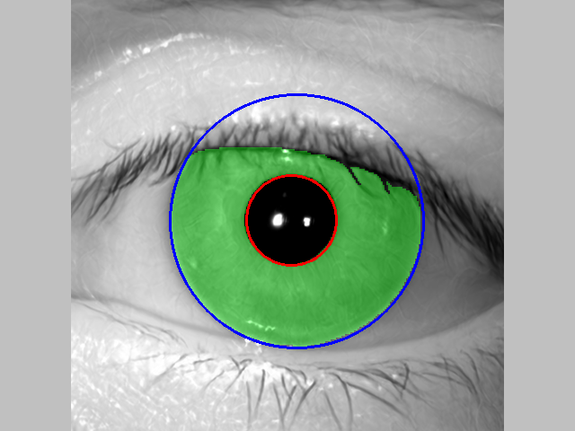

## Installation 

1. Clone the repository.
2. Download the models from:

   [https://notredame.box.com/s/ckaci6jujq27152s1rldxbpy5xughpgf](https://notredame.box.com/s/ckaci6jujq27152s1rldxbpy5xughpgf)

   and copy them to the `models` and `filters_pt` folders, respectively.

4. Upload your iris image samples to the `data` folder. This repository includes samples that were synthetically-generated by a StyleGAN3 model, and represent different (non-existing) identities.
   
6. Install dependencies using your preferred Python package manager. For `anaconda`, you can run:

```
conda create -n <environment-name> --file minimal_environment.yml
```

## Execution 

1. Run / analyze `tripletnn.py`, which loads all images from the `data` folder, performs the segmentation, feature extraction and all-vs-all matching to demonstrate how to call various functions in the TripletNN method's pipeline.
2. Processed data (e.g., segmentation results, normalized images, individual binary codes corresponding to all filtering kernels) will show up in the `dataProcessed` folder.
3. Templates will show up in the `templates` folder

Example segmentation result:


